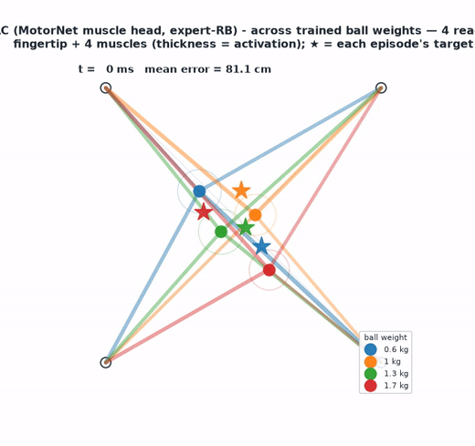

# NeuroAI Embodied-AI Capstone — how does a *brain-like* learning rule control an arm?

*A NeuroAI project investigating biologically inspired learning rules for embodied motor
control and their similarity to biological neural representations.*

Thirteen controllers learn the **same** reaching task, on the **same** simulated muscles, with the
**same** objective and the **same** parameter budget. The only thing that changes is **how each one
assigns credit** — backprop, an eligibility trace, a dendritic plateau, a dopamine burst. Then we
ask which of them looks like a real motor system.

<p align="center">
  
</p>

<p align="center"><em>A trained controller reaching for randomly placed targets. Four muscles pull a
point mass; the model only ever sees where the hand is and where the target is.</em></p>

---

## The task, in one picture

```
   goal ──┐
          ▼
    ┌───────────┐   obs[12]   ┌────────────┐  raw   ┌────────┐  4 muscle  ┌─────────┐
    │  MotorNet │ ──────────► │ controller │ ─────► │  head  │ ─────────► │ muscles │
    │   plant   │             │  (~12.3k)  │        │        │  commands  │         │
    └───────────┘ ◄───────────────────────────────────────────────────────┘         │
          ▲            the arm moves, the error shrinks                              │
          └──────────────────────────────────────────────────────────────────────────┘
```

* **Plant** — MotorNet `ReluPointMass24`: a 2-D point mass pulled by **4 muscles**, 100 steps/episode.
* **Twist** — the ball's **weight changes every episode** (10 values, 0.5–2.5 kg). Two weights
  (**1.2 kg** and **2.1 kg**) are *never trained on* and are what every score below is measured on.
* **Objective** — MotorNet's own training loss, `L = mean Σₜ ‖fingertip − goal‖₁`. No demonstrator,
  no imitation: every model learns the task itself.
* **Success** — fingertip within **5 cm** of the target ("completion rate").

---

## Why this is a fair fight

A "biologically plausible beats deep learning" claim is worthless if the two sides were given
different advantages. So everything except the learning rule is pinned:

| Held identical | Value |
|---|---|
| Objective | MotorNet's L1 position loss — *the same function* for all 13 |
| Optimiser | `Adam(lr=1e-3)`, `clip_grad_norm_(1.0)` — MotorNet's own settings |
| Batch / episode | 32 / 100 steps |
| **Policy size** | **~12.3 k parameters** (12,315 – 12,377, a 0.5 % spread) |
| Train / test weights | train on 8 ball weights, score on 2 held-out ones |
| Free to each model | **only its credit-assignment rule and that rule's step size** |

Auxiliary machinery is reported in its own column, never folded into the headline count: critics
for the off-policy learners, and the **fixed, untrained** reservoir for the local rules.

---

## The thirteen models

Full descriptions, mechanisms and paper links: **[`citation/README.md`](citation/README.md)**.

| Family | Models | Credit assignment |
|---|---|---|
| **Global-gradient** | BPTT-GRU, SHAC, SAC, FastTD3, Simba | backprop through the plant, or off-policy TD |
| **Morphological** | KINESIS | backprop, but the *body's geometry* decodes the command |
| **Local-plausible** | e-prop, RTRRL/RFLO, BTSP, R-STDP, predictive coding, 3-factor Hebb, Dendritron | local rules only — no BPTT, no weight transport |

---

## Results so far

> **Retrained on the fair, faithfulness-corrected setup** (40k episodes/model, batch 32, MotorNet's
> L1 objective, ~12.3k policy params, no demonstrator). Held-out masses (1.2/2.1 kg). Both notebooks
> regenerated with 0 errors. The plausible rules below are **faithful to their papers but not yet
> re-tuned** for the corrected mechanisms — re-tuning belongs in `4-tuning-net.ipynb`.

| Model | Family | Error | Completion |
|---|---|---|---|
| MotorNet reference (hidden 32) | global-gradient | 1.4 cm | 100.0 % |
| BPTT-GRU | global-gradient | 1.0 cm | 100.0 % |
| SHAC | global-gradient | 1.1 cm | 100.0 % |
| KINESIS | morphological | 2.7 cm | 88.1 % |
| e-prop | local-plausible | 3.0 cm | 79.7 % |
| Dendritron | local-plausible | 7.2 cm | 39.6 % |
| R-STDP | local-plausible | 9.0 cm | 31.6 % |
| BTSP | local-plausible | 9.4 cm | 29.7 % |
| RTRRL | local-plausible | 13.2 cm | 16.0 % |
| Predictive coding | local-plausible | 15.3 cm | 14.6 % |
| 3-factor Hebb | local-plausible | 12.6 cm | 7.4 % |
| SAC | global-gradient (off-policy) | 38.6 cm | 0.4 % |
| FastTD3 | global-gradient (off-policy) | 40.6 cm | 0.4 % |
| Simba | global-gradient (off-policy) | 36.5 cm | 0.2 % |
| *silent floor (do nothing)* | — | *106.6 cm* | *0 %* |

**Honest reading.** Full backprop (BPTT-GRU, SHAC) and the MotorNet reference solve the task (100%).
KINESIS is 88% (down from a leaky 91% — its output gain is now learned, not tuned on the test set).
**Model-free RL fails from reward alone** (SAC/FastTD3/Simba ~0.4%) — and SAC is now a *faithful* SAC
(soft target + entropy), so it fails honestly rather than as a mislabeled TD3. Among the plausible
rules, **e-prop leads at 80%** — its eligibility trace is the credit-assignment mechanism the task
needs; the instantaneous rules trail. That spread is the scientific result. See `docs/model_audit.md`
for each model's faithfulness to its source, and the remaining reimplementations (SHAC critic, e-prop
recurrence) still to land before the final numbers.

## Quick start

### Google Colab (no install)

Every notebook opens in Colab and installs itself from its **first cell** — GPU runtime recommended.

| Notebook | What it does | |
|---|---|---|
| `4-train-net.ipynb` | trains & scores all 13 on the 2-D task | [](https://colab.research.google.com/github/MuhammadHakami/NeuroAi-EmbodiedAI/blob/main/notebooks/4-train-net.ipynb) |
| `4-analysis-net.ipynb` | microcircuit analysis of the trained models | [](https://colab.research.google.com/github/MuhammadHakami/NeuroAi-EmbodiedAI/blob/main/notebooks/4-analysis-net.ipynb) |
| `qualitative_analysis.ipynb` | **start here** — watch any trained model reach (no training needed) | [](https://colab.research.google.com/github/MuhammadHakami/NeuroAi-EmbodiedAI/blob/main/notebooks/qualitative_analysis.ipynb) |
| `4-monkey-net.ipynb` | links models to monkey S1/M1 + human MEG *(⚠ still on the previous imitation objective — being ported, roadmap step 3)* | [](https://colab.research.google.com/github/MuhammadHakami/NeuroAi-EmbodiedAI/blob/main/notebooks/4-monkey-net.ipynb) |


### Local

```bash
git clone --recurse-submodules <this-repo>
cd NeuroAI_EmbodiedAi_Capstone

# already cloned without --recurse-submodules?
git submodule update --init --recursive

python -m venv .venv && source .venv/bin/activate
pip install torch numpy matplotlib scipy scikit-learn jupyter
pip install -e MotorNet          # pinned to v0.3.0
```

**Trained weights and datasets are not in git** (14 GB of neural recordings, 475 MB of
checkpoints). They live in Google Drive — see [Data](#data-and-weights).


### Running the tests

Each module ships one runnable self-check — no framework, no fixtures. From `notebooks/`:

```bash
python motor_core.py     # the shared objective + budget accounting are well-formed
python maze_env.py       # 108 MC_Maze puzzles load; collision fires inside a barrier, not outside
python weights.py        # checkpoint discovery is honest about what is on disk
```

Then the notebooks themselves. The quickest end-to-end check needs no training — it loads a
trained controller and scores it on the held-out ball weights:

```bash
jupyter nbconvert --to notebook --execute qualitative_analysis.ipynb --stdout >/dev/null
```

`qualitative_analysis.ipynb` is a single cell: it fetches the model zoo from Google Drive if
`save/models/` is empty, then runs any checkpoint you name.

```python
run_model("save/models/kinesis.pt")                        # 4 runs at 1.0 kg, with video
run_model("save/models/shac.pt", n_runs=6, ball_weight=2.1)          # a single weight
run_model("save/models/eprop.pt", ball_weight=[0.5, 1.2, 2.1, 2.5])  # a list of weights
run_model("save/models/btsp.pt", render=False)                       # metrics only
run_all()                                                            # every checkpoint, one table
```

To retrain from scratch (~40 min on a GPU), run `4-train-net.ipynb`; `TN_BUDGET` sets the
episode budget per model.

---

## Roadmap

```
  ✅ 1. Baseline                 MotorNet BPTT-GRU reproduces the reference reach
  ✅ 2. Many baselines           13 learners, one objective, one parameter budget,
                                 mass-randomised plant + held-out weights
  ▶️ 3. Macaque alignment        re-pose the task as the Macaque centre-out reach that
     (in progress)               was actually recorded, and cross-compare
                                 ANN ↔ biologically-plausible ↔ monkey cortex
  ⬜ 4. Human alignment          extend the same comparison to human data
                                 (MEG centre-out, intracortical M1 BMI)
```

**Step 3** re-configures the MotorNet puzzle to match the Macaque task whose spikes we already
have (Area2_Bump S1, DANDI 000127; MC_Maze M1/PMd, DANDI 000128), then asks a sharper question than
"which model reaches best": *which learning rule produces population activity that looks like the
monkey's?* **Step 4** repeats it against human recordings, testing whether the ranking survives a
change of species.

---

## Repo layout

```
notebooks/
  4-train-net.ipynb      the 13-model benchmark (start here)
  4-analysis-net.ipynb   microcircuit / representational analysis
  4-monkey-net.ipynb     model <-> brain comparison  (NOT yet on the shared objective)
  motor_core.py          ONE training loop + ONE objective, shared by all 13
  motor_zoo.py           plant, heads, gradient & off-policy learners
  plausible_learners.py  the six local biologically-plausible rules
  arch_detailed.py       per-model architecture diagrams

  # from the NeuroAgents upstream (nbrav) -- primate Area2_Bump track
  area2-explore.ipynb      Area2_Bump primate data exploration
  rnn-data-prep.ipynb      RNN-ready H5 with train/val splits + decoder lag pairs
  rnn-training.ipynb       three GRU objectives on Area2_Bump motor data
  comparison-metrics.ipynb GRU hidden dynamics vs primate area 2
  motornet_train.ipynb     MotorNet backprop RNN
citation/
  README.md              every model described, with paper links
  references.bib         BibTeX
docs/reach_demo.gif      the animation above
MotorNet/                submodule — differentiable biomechanics (read-only)
nlb_tools/               submodule — Neural Latents Benchmark loaders (read-only)
```

`MotorNet/` and `nlb_tools/` are **used read-only**. Behaviour is changed by subclassing or
wrapping in `notebooks/`, never by editing upstream.

---

## Data and weights

Not in git, by design:

| What | Size | Where |
|---|---|---|
| Neural datasets (DANDI 000127/000128, MEG) | 14 GB | Google Drive / re-downloadable from DANDI |
| Trained model zoo + videos | 475 MB | Google Drive |
| Monkey-fit checkpoints | 801 MB | Google Drive |

---

## Credits

Merged with **[nbrav/NeuroAgents](https://github.com/nbrav/NeuroAgents)** (upstream), which
contributes the primate Area2_Bump track: data exploration, RNN data prep, GRU training against
Area2 motor data, and GRU-vs-area-2 comparison metrics. That work targets the same question this
benchmark asks and feeds directly into roadmap step 3.

Built on **MotorNet** (Codol et al., *eLife* 2024). Every model, dataset and metric is cited to its
source in [`citation/README.md`](citation/README.md).
